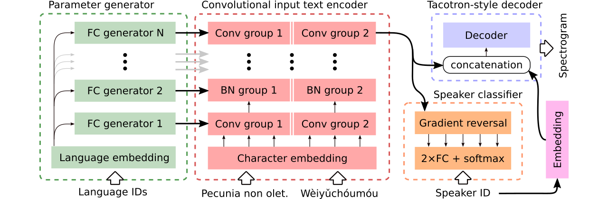

<h1 align="center">Multilingual Speech Synthesis</h1>

<p align="center">
<a href="https://colab.research.google.com/github/Tomiinek/Multilingual_Text_to_Speech/blob/master/notebooks/code_switching_demo.ipynb"><b>Interactive synthesis demo</b></a><br>
<a href="https://tomiinek.github.io/multilingual_speech_samples/"><b>Website with samples</b></a><br>
<a href="https://arxiv.org/abs/2008.00768"><b>Paper &amp; Description</b></a>
</p>

<p>&nbsp;</p>

_______

This repository provides [synthesized samples](https://tomiinek.github.io/multilingual_speech_samples/), [training](https://github.com/Tomiinek/Multilingual_Text_to_Speech/tree/master/data) and [evaluation](https://github.com/Tomiinek/Multilingual_Text_to_Speech/tree/master/evaluation) data, source code, and [parameters](https://github.com/Tomiinek/Multilingual_Text_to_Speech/tree/master/params) for the paper [**One Model, Many Languages: Meta-learning for Multilingual Text-to-Speech**](https://arxiv.org/abs/2008.00768).

It contains an implementation of **Tacotron 2** that supports **multilingual experiments** and that implements different approaches to **encoder parameter sharing**. It presents a model combining ideas from [Learning to speak fluently in a foreign language: Multilingual speech synthesis and cross-language voice cloning](https://google.github.io/tacotron/publications/multilingual/index.html), [End-to-End Code-Switched TTS with Mix of Monolingual Recordings](https://csttsdemo.github.io/), and [Contextual Parameter Generation for Universal Neural Machine Translation](https://arxiv.org/abs/1808.08493).

<p>&nbsp;</p>


<p align="center">

</p>

<p>&nbsp;</p>


_______

We provide data for comparison of **three multilingual text-to-speech models**. The first **shares the whole encoder** and uses an adversarial classifier to remove speaker-dependent information from the encoder. The second has **separate encoders** for each language. Finally, the third is our attempt to combine the best of both previous approaches, i.e., effective parameter sharing of the first method and flexibility of the second. It has a fully convolutional encoder with language-specific parameters generated by a **parameter generator**. It also makes use of an adversarial speaker classifier which follows principles of domain adversarial training. See the illustration above.

**Interactive demos** introducing code-switching abilities and joint multilingual training of the generated model (trained on an enhanced CSS10 dataset) are available [here](https://colab.research.google.com/github/Tomiinek/Multilingual_Text_to_Speech/blob/master/notebooks/code_switching_demo.ipynb) and [here](https://colab.research.google.com/github/Tomiinek/Multilingual_Text_to_Speech/blob/master/notebooks/multi_training_demo.ipynb), respectively.

Many **samples synthesized using the three compared models** are at [this website](https://tomiinek.github.io/multilingual_speech_samples/). It contains also a few samples synthesized by a monolingual vanilla Tacotron trained on LJ Speech with the Griffin-Lim vocoder (a sanity check of our implementation).

Our best model supporting code-switching or voice-cloning can be downloaded [here](https://github.com/Tomiinek/Multilingual_Text_to_Speech/releases/download/v1.0/generated_switching.pyt) and the best model trained on the whole CSS10 dataset without the ambition to do voice-cloning is available [here](https://github.com/Tomiinek/Multilingual_Text_to_Speech/releases/download/v1.0/generated_training.pyt).

<p>&nbsp;</p>


_______

<p>&nbsp;</p>

## Running

We are now going to show how to run training of our multilingual Tacotron. We used a vocoder that is based on the WaveRNN model, see [this repository](https://github.com/Tomiinek/WaveRNN) for more details, or use [our pre-trained model](#vocoding).

### :octocat: Clone repository 
```
git clone https://github.com/Tomiinek/Multilingual_Text_to_Speech.git
cd Multilingual_Text_to_Speech
```

### :mortar_board: Install python requirements 
```
pip3 install -r requirements.txt 
```

### :hourglass: Download datasets

Download the CSS10 dataset (Apache License 2.0) and our cleaned Common Voice data (Creative Commons CC0).

```
cd /project_root/data/css10
```

Visit [the CSS10 repository](https://github.com/Kyubyong/css10) and download data for all languages.
Extract the downloaded archives. For example, in the case of French, you should see the following folder structure:

```
data/css10/french/lesmis/
data/css10/french/lupincontresholme/
data/css10/french/transcript.txt
```

Next, download our cleaned Common Voice dataset:

```
cd /project_root/data/comvoi_clean
```
```
wget https://github.com/Tomiinek/Multilingual_Text_to_Speech/releases/download/v1.0/comvoi.zip
unzip -q comvoi.zip -d clean_comvoi
rm comvoi.zip
```

### :scroll: Prepare spectrograms

This repository provides cleaned transcripts and meta-files and you have already downloaded corresponding `.wav` files. However, it is handy to 
precompute spectrograms (it speeds up training). In view of that, you can run an ad-hoc script that will create mel and linear spectrograms for you:

```
cd /project_root/data/
python3 prepare_css_spectrograms.py
```

You can create the meta-file, spectrograms, and phonemicized transcripts for other datasets by applying the `TextToSpeechDataset.create_meta_file`
method to the **original downloaded and extracted data** (like LJ Speech, M-AILABs, etc., see `dataset/loaders.py` for supported datasets). Note that it is then needed to split the meta-file into `train.txt` and `val.txt` files.

### :bullettrain_front: Train

Now, we can run training. See the `params/params.py` file with an exhaustive description of parameters.
The `params` folder also contains **prepared parameter configurations** (such as `generated_switching.json`) for multilingual training on the whole CSS10 dataset and for training of code-switching models on the dataset that consists of Cleaned Common Voice and five languages of CSS10. 

**Train with predefined configurations** (recommended for quick start), for example:

```
PYTHONIOENCODING=utf-8 python3 train.py --hyper_parameters generated_switching
```

Please note the missing extension (`.json`).


**Or with default parameters** (default dataset is LJ Speech):
```
PYTHONIOENCODING=utf-8 python3 train.py
```

By default, **training logs** are saved into the `logs` directory. Use Tensorboard to monitor training:

```
tensorboard --logdir logs --port 6666 &
```

### :checkered_flag: Checkpointing

Checkpoints are saved into the `checkpoints` directory by default. They contain model weights, parameters, the optimizer state, and the state of the scheduler. To restore training from a checkpoint, let's say named `checkpoints/CHECKPOINT-1`, run:

```
PYTHONIOENCODING=utf-8 python3 train.py --checkpoint CHECKPOINT-1
```
<p>&nbsp;</p>


## Inference

For generating spectrograms, see `synthesize.py` or interactive Colab notebooks ([here](https://colab.research.google.com/github/Tomiinek/Multilingual_Text_to_Speech/blob/master/notebooks/code_switching_demo.ipynb) and [here](https://colab.research.google.com/github/Tomiinek/Multilingual_Text_to_Speech/blob/master/notebooks/multi_training_demo.ipynb)). An example call that uses a checkpoint `checkpoints/CHECKPOINT-1`
and that saves both the synthesized spectrogram and the corresponding waveform vocoded using Griffin-Lim algorithm:

```
echo "01|Dies ist ein Beispieltext.|00-fr|de" | python3 synthesize.py --checkpoint checkpoints/CHECKPOINT-1 --save_spec
```

<p>&nbsp;</p>

## Vocoding

We used the WaveRNN model for vocoding. You can download [WaveRNN weights](https://github.com/Tomiinek/Multilingual_Text_to_Speech/releases/download/v1.0/wavernn_weight.pyt) pre-trained on the whole CSS10 dataset.
For examples of usage, visit our interactive demos ([here](https://colab.research.google.com/github/Tomiinek/Multilingual_Text_to_Speech/blob/master/notebooks/code_switching_demo.ipynb) and [here](https://colab.research.google.com/github/Tomiinek/Multilingual_Text_to_Speech/blob/master/notebooks/multi_training_demo.ipynb)) or [this repository](https://github.com/Tomiinek/WaveRNN).


## Code Structure

Please, see [this file](https://github.com/Tomiinek/Multilingual_Text_to_Speech/blob/master/CODE.md) for more details about the contained source-code and its structure.
